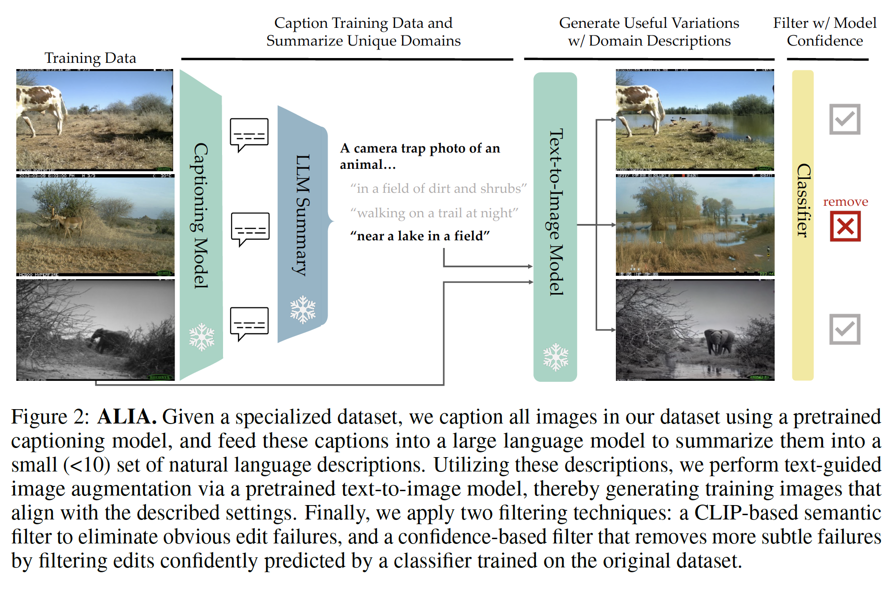

# Automatic Language-guided Image Augmentation

Official Repo for the paper "Diversify Your Vision Datasets with Automatic
Diffusion-based Augmentation"

Code coming soon! (Yell at me if its not up before mid-June)

<!-- 
## Code Structure

### Generating Captions

### Augmenting Images with Diffusion

### Filtering

### Training -->