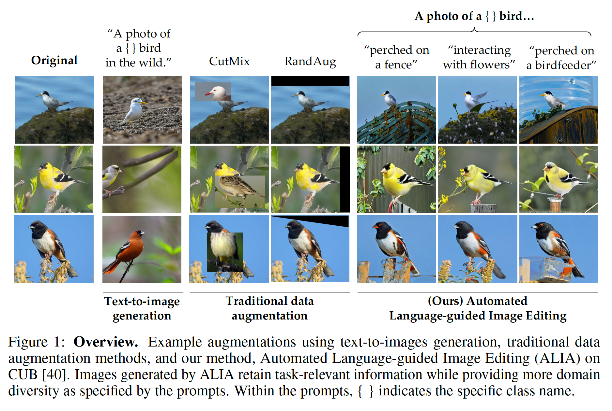

# Automatic Language-guided Image Augmentation

Official Repo for the paper ["Diversify Your Vision Datasets with Automatic
Diffusion-based Augmentation"](https://arxiv.org/abs/2305.16289)

```
article{dunlap2023alia,
  author    = {Dunlap, Lisa and Umino, Alyssa and Zhang, Han and Yang, Jiezhi and Gonzalez, Joseph and Darrell, Trevor},
  title     = {Diversify Your Vision Datasets with Automatic
    Diffusion-based Augmentation},
  journal   = {arXiv},
  year      = {2023},
}
```



## Code coming soon! (Yell at me if its not up by mid-June)

As a teaser while I clean up the filtering/training part, here's the code for generating/editing images:

----------------------------

## Getting started

Install the dependencies for our code using Conda. You may need to adjust the environment YAML file depending on your setup.

  ```
  conda env create -f environment.yaml
  conda activate ALIA
  pip install -e .
  ```

## Generating Images

All editing methods are located in [editing_methods](./editing_methods) and use the Huggingface Diffusers library. We also use the fabulous command line interface library [tyro](https://github.com/brentyi/tyro), just add `--help` flag to your command to see all the arguments in immagulate formatting.

**Per Example:** if you want to generate a ton of images given a prompt or only edit one image, use [txt2img_example.py](./editing_methods/txt2img_example.py) or [img2img_example.py](./editing_methods/img2img_example.py). 
```
python editing_methods/txt2img_example.py --prompt "Arachnophobia" --n 20
```

You should get a WandB run like [this](https://wandb.ai/lisadunlap/Text-2-Image/runs/1o3nqjqc) for text-2-image or [this](https://wandb.ai/lisadunlap/Image-2-Image/runs/6poxdpkx) for image-2-image, with the images stored in `./diffusion_generated_data`

**Per Dataset:** generating images for an entire dataset is similar to per example but uses the `class_names` attribute of the dataset to create per-class prompts. 
```
python editing_methods/img2img.py --dataset Cub2011 --prompt "a photo of a {} bird on rocks." --n 2
```
This command should output something like [this](https://wandb.ai/lisadunlap/Image-2-Image/runs/cvl0n538). For the image editing methods, we save the edits of image at index i in the training set as i-0.png

## Filtering

Once your data is generated, you can determine which indices to filter out by running
```
python filtering/filter.py -config configs/Cub2011/alia.yaml
```
This will save the indexes of the images filtered by the semantic and confidence-based filter in `filering_results`, along with samples of images filtered out. 

## Training
To train the base models or the models with augmented data, simply run the appropriate yaml file from the configs folder. For instance to train Cub2011 baseline, use the [base config](configs/Cub2011/base.yaml)
```
python main.py --config configs/Cub2011/base.yaml
```
Apply a traditional dataa augmentation technique by setting `data.augmentation=cutmix`. Available data augmentations are in the [load_dataset file](helpers/load_dataset.py).

## WandB Projects

**Datasets of Generated data [here](https://wandb.ai/clipinvariance/ALIA).** Each wandb artifact has the hyperparameters and prompt used to create it. You can download the images with
```
import wandb
run = wandb.init()
artifact = run.use_artifact('clipinvariance/ALIA/cub_generic:v0', type='dataset')
artifact_dir = artifact.download()
```
Generated Data Examples for [Txt2Img](https://wandb.ai/lisadunlap/Text-2-Image), [Img2Img](https://wandb.ai/lisadunlap/Image-2-Image), and [InstructPix2Pix](https://wandb.ai/lisadunlap/InstructPix2Pix)