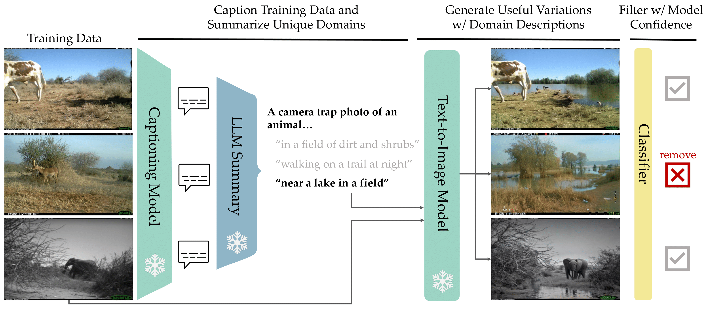

# Automatic Language-guided Image Augmentation (ALIA)



Welcome to the official repository for the paper ["Diversify Your Vision Datasets with Automatic Diffusion-based Augmentation"](https://arxiv.org/abs/2305.16289). If you prefer a condensed version, visit our [TL;DR website](https://lisadunlap.github.io/alia-website/). If you find our work useful, we welcome citations:

```markdown
@article{dunlap2023alia,
  author    = {Dunlap, Lisa and Umino, Alyssa and Zhang, Han and Yang, Jiezhi and Gonzalez, Joseph and Darrell, Trevor},
  title     = {Diversify Your Vision Datasets with Automatic Diffusion-based Augmentation},
  journal   = {arXiv},
  year      = {2023},
}
```

**UPDATE:** We are currently rerunning experiments due to a bug in our checkpointing (shoutout to EyalMuchaeli for pointing it out), so the new numbers will be updated in the paper once all the experiments are done. If you want to track our newest results, here are the wandb projects to [CUB](https://wandb.ai/clipinvariance/ALIA-Cub2011), [iWildCam](https://wandb.ai/clipinvariance/ALIA-iWildCamMini), and [Planes](https://wandb.ai/clipinvariance/ALIA-Planes). Note that the traditional augmentation baselines for CUB now outperform ALIA and when running on a ResNet50, Txt2Img beats ALIA on Planes. Due to various issues with the Planes dataset, we have replaced it with the Waterbirds dataset.

**NEW** We have added the [Waterbirds](https://github.com/kohpangwei/group_DRO) dataset(subsampled to exaggerate the real data gains but full dataset coming soon). We use the 95% bias split and use the 5% unbiased data as the extra set. Note that unlike the standard dataset, we make our val set biased as well (but our test set is unbiased). Full dataset can be either generated through [their repo]((https://github.com/kohpangwei/group_DRO)) or downloaded from [this Gdrive link](https://drive.google.com/file/d/14dVH5Dw56liz9c3dL8QYBh6TZHaiMSLb/view?usp=sharing)

## Table of Contents
1. [Getting Started](#getting-started)
2. [Prompt Generation](#prompt-generation)
3. [Generating Images](#generating-images)
4. [Filtering](#filtering)
5. [Training](#training)
6. [WandB Projects](#wandb-projects)
7. [Checkpoints](#checkpoints)
8. [Add Custom Datasets](#add-custom-datasets)

## Getting Started

To begin, install our code dependencies using Conda. You may need to adjust the `environment.yaml` file based on your setup:

```bash
conda env create -f environment.yaml
conda activate ALIA
pip install -e .
```

All experiment parameters are in yaml configs, with [configs/base.yaml](configs/base.yaml) containing all default parameters and their description. The defaults for each individual dataset are in their configs/DATASET/base.yaml folder. 

The overall pipeline is split up over several files: [caption.py](./caption.py) captions the dataset, [prompt_generation.py](./prompt_generation.py) extracts the domains from the captions, [main.py](./main.py) does all the training/eval, [filter.py](./filtering/filter.py) saves the indexes to be filtered for a given dataset, and [editing methods](./editing_methods/img2img.py) create the training data. To train a model with ALIA, the pipeline would be caption -> prompt_generation -> editing -> main (base model w/ original training data) -> filter (generated training data) -> main (model w/ filtered original + generated data). We outline the exact commands below. 

## Prompt Generation

- **Captioning**: We use the BLIP captioning model to caption the entire dataset:
  ```bash
  python caption.py --config configs/Cub2011/base.yaml
  ```
  This will save your captions [here](captions/Cub2011.csv).

- **LLM Summarization**: In our paper, we used GPT-4 to summarize the domains from the captions. Alternatively, we provide [Vicuna](https://chat.lmsys.org/) support for those who prefer not to give money to OpenAI. Download the Vicuna weights [here](https://github.com/lm-sys/FastChat/tree/main#vicuna-weights) (we used the 13b parameter model).
  ```bash
  pip3 install fastchat
  python huggingface_api.py message="Hi! How are you doing today?" #test to make sure it works
  python prompt_generation.py --config configs/Cub2011/base.yaml #return prompts
  ```
We randomly sample 20 captions to fit within the context length but highly encourage others to develop better methods :)

## Generating Images

Our editing methods are housed in [editing_methods](./editing_methods) and utilize the Huggingface Diffusers library and the [tyro](https://github.com/brentyi/tyro) CLI.

- **Per Example**: To generate multiple images given a prompt or edit a single image, use [txt2img_example.py](./editing_methods/txt2img_example.py) or [img2img_example.py](./editing_methods/img2img_example.py).
  ```bash
  python editing_methods/txt2img_example.py --prompt "Arachnophobia" --n 20
  ```

- **Per Dataset**: To generate images for an entire dataset, use the `class_names` attribute of the dataset to create per-class prompts.
  ```bash
  python editing_methods/img2img.py --dataset Cub2011 --prompt "a photo of a {} bird on rocks." --n 2
  ```

## Filtering

Once you have generated your data, determine which indices to filter out by running the following command:
```bash
python filtering/filter.py --config configs/Cub2011/alia.yaml filter.load=false
```
**NOTE**: since this filter requires a pretrained model for the confidence-based filtering, you will need to train a base model first (see below).

## Training

To train the base models or models with augmented data, simply run the appropriate YAML file from the configs folder.
```bash
python main.py --config configs/Cub2011/base.yaml
```
To apply a traditional data augmentation technique, set `data.augmentation=cutmix`. See all available data augmentations in the [load_dataset file](helpers/load_dataset.py).


## WandB Projects

Our datasets of generated data can be found [here](https://wandb.ai/clipinvariance/ALIA) under the 'Artifacts' tab. Each artifact includes the hyperparameters and prompts used to create it.

Download the images with the following command:
```python
import wandb
run = wandb.init()
artifact = run.use_artifact('clipinvariance/ALIA/cub_generic:v0', type='dataset')
artifact_dir = artifact.download()
```

View generated data examples for [Txt2Img](https://wandb.ai/lisadunlap/Text-2-Image), [Img2Img](https://wandb.ai/lisadunlap/Image-2-Image), and [InstructPix2Pix](https://wandb.ai/lisadunlap/InstructPix2Pix).

## Checkpoints

All of our runs, checkpoints, and captions are on WandB. We reran all experiments with the cleaned repo so results may be slightly different than those in the paper.
* [Cub2011](https://wandb.ai/clipinvariance/ALIA-Cub2011)
* [iWildCam Subset](https://wandb.ai/clipinvariance/ALIA-iWildCamMini)
* [Waterbirds](https://wandb.ai/clipinvariance/ALIA-Waterbirds)

Seriously, Weights and Biases, send me a care package; I'm giving you some serious promo here. 

 ## Add Custom Datasets

To add your own dataset, you need to add a file to the datasets folder and then add it as an option in [helpers/load_dataset.py](helpers/load_dataset.py). The repository expects a dataset object of a specific format, where `__getitem__` should return three things: image, target, and group (group is the domain the image is in, set to 0 if it's not a bias/DA dataset).

Additionally, the dataset class needs to have the following parameters: `classes, groups, class_names, group_names, targets, class_weights`. Here's an example:

```python
class BasicDataset(torchvision.datasets.ImageFolder):
    """
    Wrapper class for torchvision.datasets.ImageFolder.
    """
    def __init__(self, root, transform=None, group=0, cfg=None):


        self.group = group # used for domain adaptation/bias datasets, where the group is the domain or bias type.
        super().__init__(root, transform=transform)
        self.groups = [self.group] * len(self.samples) # all images are from the same domain, set the group label to 0 for all of them
        self.group_names = ["all"] # only one group name (used for logging)
        self.class_names = self.classes # used for logging
        self.targets = [s[1] for s in self.samples] 
        self.class_weights = get_counts(self.targets) # class weights for XE loss

    def __getitem__(self, index):
        img, target = super().__getitem__(index)
        return img, target, self.group
```

After adding your dataset to the [get_dataset](helpers/load_dataset.py) function, create a default config and set `data.base_dataset` to the name of your dataset. Then you should be able to generate the prompts and images, mimicking the `data.extra_dataset` parameters for CUB but replacing `data.extra_root` with the location of your generated data. 

For example, suppose you want to add a typical PyTorch ImageFolder dataset like ImageNet. You can manually determine how much data to add through either the extraset (real data baseline from the paper) or through the [data.num_extra](configs/base.yaml) parameter. If you want to use ALIA or other methods to improve performance, don't worry about the real data baseline and set `data.num_extra` to the number of augmented samples you want to add. For this example, say you want to add 1000 augmented samples to your training set. 

Since we already have a wrapper for the ImageFolder class in [datasets/base.py](datasets/base.py), you can use that to add your dataset (like ImageNet) into the `get_dataset` function.

```python
def get_dataset(dataset_name, transform, val_transform, root='./data', embedding_root=None):
    .....

    elif dataset_name == 'ImageNet':
        trainset = BasicDataset(root='/path/to/imagenet/train', transform=transform)
        valset = BasicDataset(root='/path/to/imagenet/val', transform=val_transform)
        extraset = None # set to none since we are specifying the amount of generated data to add with data.num_extra
        testset = BasicDataset(root='/path/to/imagenet/val', transform=val_transform)
    ......

    return trainset, valset, testset, extraset
```

Now all you need to do is create your config:

```yaml
base_config: configs/base.yaml # this sets default parameters
proj: ALIA-ImageNet # wandb project
name: ImageNet # name of dataset used for logging (can set this to anything)

data: 
  base_dataset: ImageNet # name of dataset used in the new_get_dataset method
```

From here, you should be able to follow the README as normal. 
